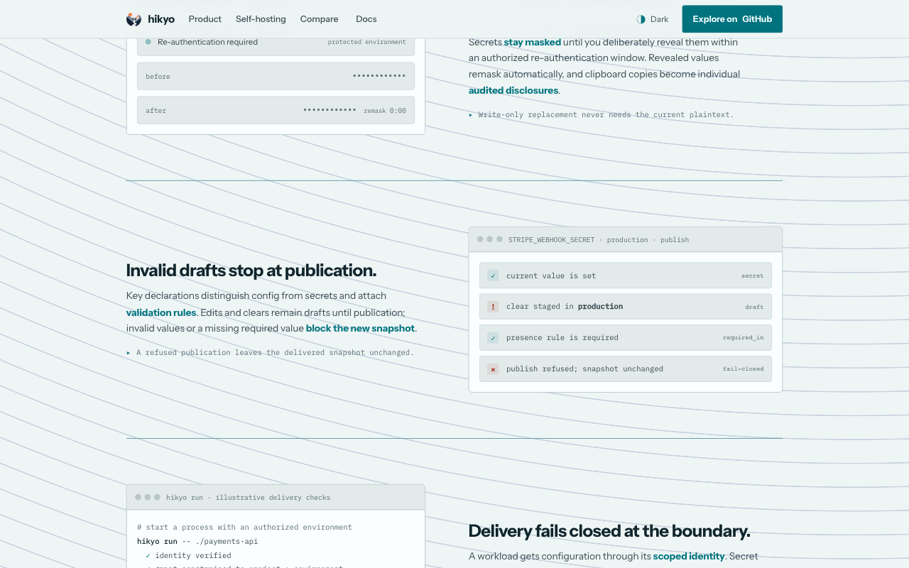
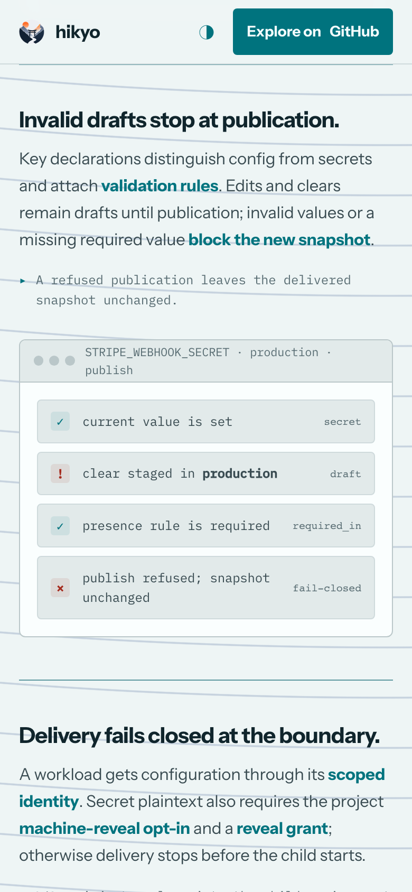

# Landing page and documentation audit, 9 October 2026

## Result and scope

The landing page and all 53 public user guides were audited against the current local implementation, with runtime checks selected for their claims. Supported discrepancies were corrected locally. The audit began at commit `36c323c41` on `dunky13/sync-landing-docs`. No commit, PR, merge, release or deployment is claimed. Historical ADRs, specifications, handoffs and frozen prototypes were preserved.

Evidence has different strengths: actual CLI and HTTP flows, real SQLite/PostgreSQL storage tests, chart rendering, mounted UI tests with network doubles, and direct desktop/mobile browser checks. The appendix records what each proves and its limits. A guide with no correction is not a claim that every possible external integration was exercised.

## Main corrections

| Area | Previous claim or problem | Corrected behavior and evidence |
| --- | --- | --- |
| Drafts and publication | Invalid writes and required clears refused at write time | Edits/clears stage drafts; publication validates schemas, presence and group closure. Real conformance tests preserve the delivered snapshot after refusal on both engines. |
| First project | Required everywhere before values; no publication; key shown by name | Optional first key, explicit version publication and immutable key ID inspection. Real CLI tutorial walkthrough verifies the result. |
| Local onboarding | Loopback HTTP without authenticated socket | Owner-only Unix socket configured before credential establishment/login, with Windows HTTPS boundary. Controlling-terminal credential and TOTP flow exercised. |
| Production setup | Plain source build deployable; incomplete startup inputs | Signed release executable, authenticated bundle, independent operator pin and persistent custody. Actual source binary refuses production serving. |
| Kubernetes installation | Incomplete values example | Required public and state PVC references, provisioning prerequisites. Original refuses chart schema; corrected chart and full chart assertions pass. |
| Database security | Remote verify-ca accepted | Remote PostgreSQL requires hostname-verifying verify-full. Actual config refusal and existing tests confirm. |
| Metrics and probes | Trusted network metrics scrape; health at API port | Operational listener owns probes; metrics reject non-loopback peers even with forwarded loopback headers. Real HTTP checks and denial tests pass. |
| HA | Exactly-once background work | Fenced singleton leadership; failover repeats catch-up. Three schedulers tested against real dedicated PostgreSQL. |
| Federation | Forgejo repository path sufficient | Forgejo binding refused without immutable repository identity; scoped bearer credential alternative. Compiled CLI help/refusal and isolation tests. |
| Product status | Implemented features described as future | Current onboarding, dynamic browser management, PKI, SSH, transit, scanning and adapters described with remaining limits and release evidence separated. |
| Access | Publish could not be narrowed; browser edit remove/add | Publish supports key rules with group closure; browser replacement atomic. Both-engine authorization tests and mounted UI tests pass. |
| MCP | Only five tool metric labels | Closed metric labels include optional staging/validation tools; default read-only behavior distinguished from opt-in writes. Transport and registry tests. |
| Build and catalogue | Wrong UI output path, incomplete adapters/settings | Actual web build emits internal/webui/dist; current adapters and managed settings documented. Exact UI-tagged Go build passes. |
| Landing layout | Reveal and delivery copy overlapped demos | Animation .flip selector scoped to coverage counter. Actual computed geometry changes from overlap to zero intersection for all four feature rows at 390px and 1440px. |
| Comparison | Dated/unverified negative competitor claims | Official sources refreshed; unestablished equivalents marked with question marks; HA/recovery corrected; licensing scope qualified. |

README and PRODUCT now agree on explicit values and validated publication. The implementation ledger names the current Astro/Fumadocs documentation stack and includes current source and audit evidence.

## Combined validation

- Full SQLite and PostgreSQL conformance corpus: PASS, 175 passing subtests, 77.304 seconds. Dedicated disposable database; no PostgreSQL skip in this run.
- Product isolation: PASS on both engines, including onboarding/recovery, rules, reveal ceremonies, SCIM/SAML fixtures, transit, PKI, SSH and material-free dynamic lifecycle audit. Additional per-key publication/group closure/replacement suite passed both engines.
- Real OpenSSH authentication, expiry, KRL and CA rotation: PASS without skips. Compiled scanner workflows exercised paths, index, worktree, redaction and refusal exit codes. History/range behavior was reviewed against source but not executed in the compiled scanner workflow checks.
- CLI, HTTP API, MCP transports, Compose, filesync and delivery checks: PASS. Built executable help and actual scratch-server metadata/probe responses checked.
- Operations: PASS for chart assertions, real PostgreSQL HA election/failover, backup/restore/runtime, configuration, parameters, privacy/retention/adapters, upgrade gate, rollout and runtime configuration.
- Web build and exact Go UI-tagged source build: PASS. Mounted dynamic-secret and rule dialogs: 64 tests PASS.
- Documentation `pnpm run verify`: PASS, zero Astro errors/warnings/hints; asset, OSS policy, PWA, CSP, LLM Markdown consistency and offline-browser gates.
- Status ledger and contradiction fixtures: PASS, 35 entries verified. Internal landing/docs link and anchor check: 3,784 links across 54 pages, zero failures before final content refresh; Final link and anchor check: 3786 links across 54 pages, 0 failures.
- Collaborative browser: landing, first-project and roadmap render at desktop/mobile widths with no document horizontal overflow; mobile matrix tabs and theme switch exercised; final feature-row geometry shows no overlap.
- All 10 landing declaration examples compiled using the real Go schema compiler after correcting enum members, min_length and unsupported hostname type.
- `git diff --check`: PASS. Structural graph refreshed; graph navigation was treated as a map, not runtime evidence. Astro parser warnings mean some graph relationships are partial.

Initial parallel PostgreSQL audit commands collided because multiple test processes reset the same schema. That run was discarded, isolated databases were assigned, and authoritative reruns passed. This was audit harness coordination, not evidence of a production application failure.

## Browser evidence

Desktop publication and delivery sections after the selector correction:

Mobile publication section after correction:

The HTML companion embeds screenshot bytes and all styles. It opens without network access.

## External sources and release state

Comparison sources checked on 9 October 2026: [OpenBao use cases](https://openbao.org/docs/use-cases/), [OpenBao HA](https://openbao.org/docs/concepts/ha/), [OpenBao KV v2 recovery](https://openbao.org/docs/secrets/kv/kv-v2/), [Infisical plans](https://infisical.com/pricing), [Infisical self-hosting](https://infisical.com/docs/self-hosting/overview), [Phase plans](https://phase.dev/pricing/), [Phase self-hosting](https://docs.phase.dev/self-hosting), and [Phase config/secret types](https://docs.phase.dev/console/secrets). These are published documentation/plan evidence; third-party deployments were not tested.

Read-only GitHub release inspection listed prereleases and the latest-stable endpoint returned HTTP404. This supports keeping the pre-1.0 qualification; it does not certify a signed nightly for production use.

## Explicit limits

No production instance was mutated. No billable cloud infrastructure was provisioned. No external IdP, hardware passkey, real dynamic-secret database role lifecycle, HSM/KMS, operator live cluster, regulatory certification or final release acceptance was claimed. Cloud guides were compared to shipped templates and their stated activation boundaries. Chart rendering proves wiring and refusals, not live Kubernetes admission. Dynamic lifecycle fixtures use provider doubles; mounted UI tests use network doubles. Historical reports are preserved as dated evidence rather than rewritten into current promises.

The preview remains available at http://192.168.0.30:4329/ for review. It serves only the static public documentation build. Temporary audit databases and credential-bearing development servers are removed after validation.

## Detailed evidence and coverage

### CLI and integration guides

Scope: public docs CLI reference, installation, build from source, local development, contexts, Compose, file sync, HTTP API, MCP, machine identities. Current local checkout; no historical reports/specifications edited. No commits.

### Corrections

- `build-from-source.mdx`: documented `web/dist` was wrong. The actual web build emits `internal/webui/dist`, which the UI-tagged binary embeds.
- `machine-identities.mdx`: grant example used service-account row ID as principal ID and omitted environment scope for a workload. Corrected to `mch_...`, explicit `read`, environment scope.
- `machine-identities.mdx`: Forgejo federation recipe was stale and unsafe. Actual CLI help refuses Forgejo issuers because token repository paths are not immutable repository identifiers; changed to refusal plus scoped bearer alternative.
- `mcp.mdx`: telemetry tool labels now include both write tools even when disabled, matching actual pinned metric registry.
- `http-api.mdx`: discovery includes instance identity and delivery-status protocol capability, not only authentication flows.
- `http-api.mdx`: operational probes use separate operational listener; real application listener answered healthz 404, operational listener answered healthz/readyz 200.
- `local-development.mdx`: narrowed “writes no values” to “writes no plaintext values”, consistent with verified encrypted offline snapshots.
- `cli-reference.mdx`: adapter family now lists all seven providers rather than only Forgejo/GitHub Actions.

### Empirical evidence

1. `go build -o /tmp/hikyo-doc-audit ./cmd/hikyo` passed. Binary `version` prints `Hikyo dev`.
2. Built binary help executed for client, server, service accounts, contexts, Compose, file sync, adapters, file targets, machine-reveal settings, keys and values. Saved `/tmp/hikyo-cli-doc-help.txt`, `*-help.txt`. Confirms documented delivery flags; no compose adopt; file-sync doctor local only; credential channels; Forgejo binding refusal; key create vs key declare; values set stages and values publish publishes.
3. `pnpm --dir clients/ts install --frozen-lockfile`, `pnpm --dir web install --frozen-lockfile`, and `pnpm --dir web build` passed with Node 26.7.0/pnpm 11.24.0. Build output explicitly lists `../internal/webui/dist/index.html` and assets; precompressed 20 representations. Logs `/tmp/hikyo-cli-doc-web-install-client.log`, `...web-install.log`, `...web-build.log`.
4. Targeted CLI tests passed: Help/EveryVerbHasHelp/Context/ThereIsNoPersistentActiveContext/MachineTokenChannels/ServiceAccountGrammar/Run/Compose/FileSync/MachineExport/AutomationVerbs (3.077s). Separate resolution precedence, sparse hierarchy refusal and missing-dimension tests passed (1.710s). Logs `/tmp/hikyo-cli-doc-tests.log`, `...targets.log`.
5. Full package suites passed: mcpserver (1.027s), compose (13.082s), filesync (9.738s), delivery (0.265s). Tests exercise strict config, dotenv round-trip/refusal, snapshots, offline audit, rendering publication, loader-control refusal, transport/tool schemas, modern/Codex compatibility. `/tmp/hikyo-cli-doc-packages.log`.
6. Actual datastore/keyring isolation tests passed (66.848s): MCP read canary/denial, MCP writes through both modern and Codex transport (stage inert draft, validate no draft, no publication/secret leakage), pending secret draft redaction, file-target lifecycle narrowing and delete refusal, machine-reveal opt-in, federation immutable identifiers (including Forgejo refusal), nested Kubernetes UID, immutable binding replacement. SQLite; PostgreSQL was not configured in this agent's run. `/tmp/hikyo-cli-doc-isolation.log`.
7. HTTP API contract/auth/health targeted tests passed (1.569s): closed discovery allowlist, unknown request refusal, login contract, separate health stack, browser cookie-only session, CLI cookie-free bearer login, CSRF requirement, uniform/error fail-closed policies. `/tmp/hikyo-cli-doc-api.log`.
8. Pinned metric registry test passed (1.061s), validates all seven tool names in the closed metric label set. `/tmp/hikyo-cli-doc-metrics.log`.
9. Required-clear conformance scenario passed on real SQLite (0.12s scenario, 3.438s package): `go test ./internal/conformance -run '^TestConformanceSQLite$/^required_in_absent_vetoes_publish$' -count=1 -v`. A required key clear stages successfully, ongoing delivery remains intact, publish refuses naming key/environment, revision stays unchanged, draft remains pending. `/tmp/hikyo-cli-doc-required.log`.
10. Actual server scratch workflow: `/tmp/hikyo-doc-audit server --dev --listen 127.0.0.1:58090 --operational-listen 127.0.0.1:58091` from `/tmp/hikyo-cli-doc-runtime`. Startup generated mode-0600 development root key and SQLite DB. Real HTTP GET `/api/v1/meta` returned API revision 9, instance identity, local-password and delivery-target-report/1. Main healthz 404; operational healthz and readyz 200. Server terminated after checks. Safe logs/files under `/tmp/hikyo-cli-doc-runtime`.
11. `git diff --check` passed.

### Boundaries

- Root independently checked GitHub release publication and found only prereleases/no latest stable release, so existing 0.x/no stable release installation guidance retained.
- Installation/release verification and external cloud/client historical evidence remains explicitly bounded; no production install, package install, external model/provider request or native Codex client test was performed here.
- Current scope validates Hikyo's loader controls and delivery, not third-party varlock/dotenvx/other vendors' full behavior.
- Ignored web build output was retained as a local build artifact.

### Added tutorial runtime coverage

Root extended scope to getting-started and first-project after product agent corrected staged/published tutorial semantics.

- Exact compiled CLI `account establish-credential --instance http://127.0.0.1:58090 --as admin` failed with exit 4: `loopback http trust requires an authenticated local CLI socket`. Real server startup with `--cli-socket` in a mode-0755 parent also refused, naming required mode0700. Fixed getting-started startup to create dedicated mode0700 `.hikyo-runtime`, pass `--cli-socket`, and pass `--socket` during credential establishment. First-project login commands now include the socket. Documented Linux/macOS Unix socket path and Windows HTTPS requirement.
- Executed generated scratch authority/password/TOTP with a real controlling PTY (pexpect), rather than bypassing security boundaries. Credentials never went to argv/environment/printed logs. Establishment, local login, TOTP enrolment, confirm, and fresh-code step-up passed. Synthetic authority and provisioning URI files deleted afterward.
- Actual `org create demo -o json` passed, implicitly revoked session, then re-login/step-up passed; actual project create and both development/production environment create commands passed.
- Actual context create/show, config key create with string declaration, file-input values set, and selective values publish passed.
- Exact tutorial `key show LOG_LEVEL` failed exit4 with API contract `(key)` error. Fixed tutorial to retain/use immutable key ID from key create; actual key show key ID passed.
- Actual values get JSON asserted `debug`; values diff showed development `set debug`, production `absent`, proving no fallback/inheritance.
- Extended actual workflow through workload service-account create, environment read grant on `mch_...`, one-hour credential file mint, and `run --config-only --token-file ... -- /usr/bin/printenv LOG_LEVEL`. Child output asserted exactly `debug`.
- Redacted command evidence `/tmp/hikyo-cli-doc-tutorial.log`, `/tmp/hikyo-cli-doc-tutorial-resume.log`, `/tmp/hikyo-cli-doc-tutorial-inspect.log`. Intermediate Python JSON parsing failures arose from PTY stderr merge/list wrapper assumptions; actual CLI operations had succeeded and were resumed using separate stdout/stderr capture. They do not weaken the command-success proof.
- Exact documented `go build -trimpath -tags ui -o /tmp/hikyo-doc-audit-ui ./cmd/hikyo` passed. UI-tagged binary booted on separate scratch SQLite directory; real HTTP browser-style `GET /login` with `Accept: text/html` returned200 with application root and generated asset references (the initial curl without HTML Accept correctly returned404). UI server terminated. This proves embedded UI availability; visual browser fidelity is outside this agent's scope.

Final coverage: read/reviewed all ten assigned docs; corrections in six initially assigned pages plus getting-started and first-project after empirical tutorial failures. Contexts, Compose, file-sync, installation retained apart from validated related command contracts and test evidence. Historical MCP interoperability observations remain historical and were not relabeled current passing claims. No external vendor loader experiment, production cloud deployment, release signing/install ceremony, native Codex/model request, or Windows runtime check performed.

Cleanup: main scratch tutorial API server terminated after scanner checks completed; UI scratch server terminated. Synthetic bearer, CLI session/trust state, SQLite databases, root keys and transient sockets removed. Only sanitized logs, fixture IDs, command scripts and build artifacts retained. No active processes owned by this audit remain.

### Product guides

Scope: public product guides under docs/site/src/content/docs/docs. No commits. Historical ADR/spec records remain unchanged. Operational guides and CLI/platform docs owned by sibling workers are excluded.

### Corrections

- core-concepts: replaced false write-time validation contract with draft/publication boundary; qualified reauthentication by policy.
- values-and-secrets: stage and publish explicitly; publication validates required/forbidden/schema/group constraints.
- values-workflows: added draft publication step; required clear is saveable but not publishable; immediate copy/import distinguished from drafts.
- first-project: removed required-in-all declaration that was impossible across empty environments; added explicit publication before inspection.
- dynamic-secrets: replaced obsolete CLI/API-only claim with implemented browser Providers/Leases management.
- browser-operations: described current core lifecycle without blanket parity claim; added dynamic/certificate locations; named outstanding transit browser gap.
- identity-and-access: documented current key-narrowed publication/member management and atomic browser rule replacement versus two CLI operations; added implemented default-closed policy-driven local/federated onboarding.
- hierarchy: clarified all-or-none applies to published state, not incomplete drafts.
- architecture: corrected probes/metrics to separate operational listener and loopback metrics boundary.
- index: first-project card now says publish; roadmap link current title.
- roadmap: replaced dated September future-feature assertions with current implemented boundaries and retained exact-candidate release/deployment evidence limits.

### Section coverage and evidence

| Guide | Sections covered | Evidence / limits |
| --- | --- | --- |
| Core concepts | Scope, no inheritance, disclosure, validation, authorization, audit | Conformance draft/required/group scenarios; isolation member rules, reveal and audit lifecycle |
| Hierarchy | Organisation/project/environment/folder/key/group, cloning, model | Conformance catalogue/value lifecycle and project scope; no live production deletion attempted |
| Values and secrets | Declaration, classification, presence, stage/clear/replace, reveal | Real datastore/keyring conformance scenarios; required clear saved then publish refused |
| Value workflows | Inventory, file/stdin setting, clear, diff, copy, reveal, scaffold/import/export | CLI service contracts plus conformance; copy/import are immediate publication, not draft operations; full CLI workflow owned by sibling |
| First project | Login/TOTP, org creation/session, hierarchy/context, declaration/set/publish/inspect | Publication behavior empirically checked; command help/CLI flow coordinated with sibling |
| Identity/access | Principals, scopes, rules, onboarding, sessions, recovery, indistinguishable refusal | Real service/storage registration, OAuth2, member-rule isolation; atomic rule UI 64 targeted tests |
| Account security | Profile, TOTP, step-up, recovery-code generation/spend, reset, passkeys | Recovery lifecycle and reveal gate isolation; no real hardware passkey or external IdP acceptance claimed |
| SAML | Metadata/trust confirmation, create/inspect/refresh/disable/remove, SP-key lifecycle | SAML login/replay isolation using local provider fixtures; external workforce IdP not tested |
| SCIM | Binding, credential disclosure/rotation, lists, mappings, deletion | Binding/user/mapping lifecycle and email never-links isolation; external IdP SCIM integration not tested |
| Browser operations | Core journey, low-frequency surfaces, exemptions/parity, managed-config links | Real mounted MachineAccess dialog/reset tests exercise Providers/Leases; full live-provider browser lifecycle was not exercised by these mounted tests |
| Dynamic secrets | Custody/config, TLS/private egress, mint/renew/revoke/settle, expiry/session limits, audit | AuditCore runs real service/runtime/storage with provider double; no real TLS PostgreSQL admin-role lifecycle certification |
| Transit | Algorithms/policy, crypto/data keys/MAC, versions/lifecycle/custody/erasure/audit/limits/refusals | Real encryption and transit service/storage lifecycle; external custody explicitly unimplemented |
| Private PKI | Root/offline intermediate/import, profiles/bindings, issue/renew/revoke/history/CRL/rotation/restore/monitoring | Real X.509 issuance lifecycle isolation; no external offline-root ceremony or CRL hosting attempted |
| SSH certificates | CA/profile/host config, issuance, revocation/KRL, rotation, HA/restore, monitoring | Real OpenSSH sshd/client authentication, KRL refusal, expiry and CA rotation passed without skips |
| Repository scanning | Paths/index/history/ranges, no-secret output, exit codes/budgets/config/hooks/CI, relationship to value-entry scan | Current compiled binary: clean=0, synthetic finding=1, invalid config=2; staged index remains finding while edited worktree is clean; JSON/SARIF contain no matched token; no history/forge SARIF upload performed |
| Architecture | Roles/listeners, probes, API/storage/encryption/startup | Operational HTTP route/readiness/metrics tests; deployment/hardening details owned by ops |
| Roadmap | Current capabilities, remaining implementation, release/deployment evidence | Current tests establish local implementation only; no release/issue closure is inferred |

### Executed checks

- web targeted MachineAccess.dialog-reset and rules.replacement: 2 files, 64 tests passed. Actual mounted forms, mocked network dependencies; no live browser/provider claim.
- SQLite conformance required_in_absent_vetoes_publish, selective_publish_closes_over_key_groups and pending_draft_preview_is_owner_filtered_and_classification_safe: all passed.
- Same three conformance scenarios on SQLite and PostgreSQL: all passed. Initial PostgreSQL shared database caused unrelated schema collisions in parallel suites; final isolation rerun uses dedicated hikyo_docs_product and one process.
- Initial registration/federated/local/OAuth2/SCIM targeted isolation: passed in 98.321s, PostgreSQL skipped because DSN was not yet supplied.
- Initial registration/transit/PKI/SSH/member-rule/reauth targeted SQLite isolation: passed in 162.397s, PostgreSQL skipped.
- Real OpenSSH suite: passed in 3.727s including TestOpenSSHAuthenticationKRLExpiryAndRotation (1.74s), no skip.
- Operational HTTP checks: passed in 4.121s, including readiness timeout/cancel, absent public operational routes and non-loopback metrics refusal.
- Final dedicated-database both-engine isolation: 14 critical tests passed on both SQLite/PostgreSQL in 133.701s; no skips. Covers AuditCore dynamic/provider-double lifecycle, recovery, local signup, member rules, PKI, registration, positive/zero reveal windows, machine no-reauth, SAML replay, SCIM binding/mapping, SSH and transit lifecycle.
- Additional key-narrowed publication/history, group-closure and atomic replacement both-engine checks passed in 9.334s with no skips.
- Real compiled scanner six workflows passed: file clean/finding, strict config rejection, staged JSON/SARIF and differing clean worktree; expected exits 0/1/2, no matched material output. Log: /tmp/hikyo-product-doc-scanner.log.
- git diff --check passed.

No production mutation, release acceptance, external identity provider, cloud provider or real dynamic provider result is claimed.

### Operations guides

Scope: self-hosting, configuration, managed configuration, configuration rollouts,
environment parameters, backup/restore, HA, compliance and privacy, cloud/provider
installation and upgrades, container upgrades, Kubernetes operator, adapters,
troubleshooting. No production changes or deployments were performed.

### Corrections

- self-hosting: replaced source-build-as-production instructions with verified
  signed release installation. Added authenticated public bundle, independently
  pinned operator public key, persistent installation custody to the production
  contract and example.
- kubernetes-operator: added both required upgrade PVC references and their
  provisioning/regular-file/ownership contract to the installation example.
  Explicit unattended mode retains independent state and scratch-DB requirements.
- configuration/troubleshooting: added missing production release-admission
  requirements and startup failure resolution. Server flags now include installed
  CLI socket, unattended opt-in, rollout enrollment and signer flags.
- configuration/self-hosting: corrected remote Prometheus scrape promise.
  Actual non-loopback IPv4/IPv6 peers receive 403, even with forwarded loopback
  headers. Local or same-pod collector must forward independently.
- high-availability: replaced exactly-once claim with fenced leader coordination;
  newly elected leaders run catch-up again.
- managed-configuration: removed stale 27-value catalogue count; documented
  current second-factor and MCP write settings, and fixed retention language.

### Executed evidence

- `go build -o /tmp/hikyo-doc-audit ./cmd/hikyo`: produced current source executable.
- Source production server with explicit fresh SQLite, private root-key file,
  loopback listeners and canonical loopback origin exited 1:
  `boot: refusing to serve: binary has no bounded production trust stamp`.
  Log: /tmp/hikyo-doc-production-refusal.log.
- `helm template` using original documented Kubernetes values refused missing
  `upgrade.existingClaim` and `upgrade.stateExistingClaim`; corrected values
  rendered successfully. Files: /tmp/hikyo-doc-chart-original.error,
  /tmp/hikyo-doc-chart-fixed.yaml.
- Corrected HA chart render proves replicas=3, HIKYO_HA, pod-name node identity,
  PodDisruptionBudget minAvailable=2, separate upgrade public/state claims.
  File: /tmp/hikyo-doc-chart-ha.yaml.
- `bash scripts/ci/check-chart.sh`: PASS, complete RBAC, operator allowlists,
  network refusals, HA guards, configuration rollout projections and tuple
  assertions. Log: /tmp/hikyo-doc-chart.log.
- `go test ./internal/server -run TestOperationalMetricsRefuseNonLoopbackClients
  -count=1 -v`: PASS, loopback IPv4/IPv6 accepted; remote IPv4/IPv6 refused;
  X-Forwarded-For does not confer scrape authority. Log: /tmp/hikyo-doc-metrics.log.
- `HIKYO_TEST_POSTGRES_DSN=<dedicated disposable Hikyo audit PostgreSQL> go test
  ./internal/app -run TestScheduler -count=1 -v`: PASS including
  TestSchedulerHAThreeNodesOnePostgres (7.15s). Three real schedulers use one
  datastore lease; leader shutdown causes another leader and another catch-up.
  Leader-only work, lease-loss/block cancellation, provisional lease release,
  deadline and stale-success tests pass. Log: /tmp/hikyo-doc-scheduler-postgres.log.
- `go test ./internal/parameters -count=1`: PASS. Log: /tmp/hikyo-doc-parameters.log.
- Current executable `server`, `backup`, `restore`, `instance-config`, `doctor`
  `--help`: executed and checked against documented flags/verbs. Logs:
  /tmp/hikyo-doc-{backup,restore,managed,doctor}-help.log.
- Full `internal/config` and `internal/backupreceipt` tests pass as part of the
  focused suite. They cover HA database/node/root requirements and unattended
  separate PostgreSQL scratch/HA refusal, retention limits, malformed config,
  artifact authentication and durability.
- `git diff --check`: PASS.

### Coverage and limits

Operational pages were read against owning configuration, scheduler, release gate,
backup and rollout source and their executed tests. Provider deployment guides
explicitly say their infrastructure templates do not install Hikyo, and cloud
recipes explicitly distinguish local validation from provider deployment proof.
No cloud account deployment, real provider billing/networking, private production
inventory, regulatory assessment, or real Kubernetes live admission was performed.
Chart rendering validates declared wiring; it is not a live cluster test. Dedicated
real PostgreSQL strengthens the HA evidence beyond rendering/config checks.

Additional spot checks: the self-hosting `install -m 0600 /dev/stdin` root-key
pipeline was exercised with harmless test bytes inside the disposable Linux
PostgreSQL container. GNU install produced the expected private 0600 regular
file. Root packageManager is pnpm@11.24.0, matching the source-build command.

Read-only cloud template inventory: AWS CloudFormation and Azure ARM resources
are present under install/cloud; Compose nightly recipe exists at
install/cloud/compose/nightly.yaml. Provider guides correctly separate
infrastructure provisioning from verified Hikyo runtime activation. External
provider UI names, regional prices and billable account provisioning were not
empirically revalidated by this local audit.

Focused backup/managed runtime check PASS (66.3s), including SQLite and dedicated
PostgreSQL ordinary archive export/data-only restore, invalid public trust before
DB creation, recurring export interval, failed-export durability/no plaintext,
archive retention pruning, failed-drill cleanup preserving existing targets,
managed TLS restart after deleting original files, and installed per-node backup
destination. Command: `HIKYO_TEST_POSTGRES_DSN=<disposable audit PostgreSQL> go test
./internal/app -run 'Test(BackupExportJob|BackupPruneJob|BackupScheduled|NodeRuntimeManagedRestart|NodeRuntimeScheduledBackup|FailedRestoreDrill|OrdinaryBackupPublicAdmission|InvalidPublicTrust|RestoreDiagnosticsAuthentication)'
-count=1 -v`. Full log: /tmp/hikyo-doc-backup-runtime.log.

Additional security correction: self-hosting/configuration allowed remote
PostgreSQL `sslmode=verify-ca`, but current config tests explicitly reject it.
Executed current CLI with a remote verify-ca DSN; refusal says remote host
requires `sslmode=verify-full (certificate and hostname verification)`.
Corrected both pages. Log: /tmp/hikyo-doc-pg-ca-refusal.log.

Broad contract check PASS (289.538s): `go test ./internal/parameters
./internal/isolation -run 'Test.*(Parameter|Privacy|AuditRetention|Adapter)'
-count=1`. The filtered parameters package matched no test names, so its separate
unfiltered 0.280s passing run is the parameters parser evidence. Isolation
matched environment template/history/render/schema/wire/copy compatibility,
identity privacy lifecycle/export/restriction/erasure, audited retention expiry,
rollback-on-receipt-failure, and adapter authorization/runtime/provider contract
tests. This invocation had no PostgreSQL DSN, so PostgreSQL isolation legs were
skipped; it establishes SQLite behavior and bounded fake/mock provider behavior,
not external provider deployments. Full log: /tmp/hikyo-doc-ops-isolation.log.

Final focused package suite PASS: `go test ./internal/config
./internal/backupreceipt ./internal/upgradegate ./internal/configrollout
./internal/runtimeconfig`. Results: config 2.683s, backupreceipt 2.276s,
upgradegate 466.130s, configrollout 1.808s, runtimeconfig 0.409s.
This exercises production signed gate/process crash/restart and operator custody,
backup receipt authentication/durability, exact bootstrap source/profile
preparation, isolated owner/node projections and invalid catalogue/policy
rejection. Log: /tmp/hikyo-doc-ops-tests.log. All agent-started checks completed.

Final review follow-up: separated sealed-webhook adapter syntax from repository/environment destinations. The existing TestAdapterTargetInputRoutesSealedWebhookToNamespaceOnly passed (CLI package 0.951s), accepting the receiver namespace and refusing repository, destination-environment and visibility inputs. Clarified that publication can include related pending drafts through key-group closure. TestMemberAccessRulesPublishChecksGroupClosure/sqlite passed (isolation package 2.300s): one selected draft published two grouped drafts after both were authorized; incomplete authorization refused publication. This focused follow-up ran SQLite only; earlier both-engine closure evidence remains recorded above.
